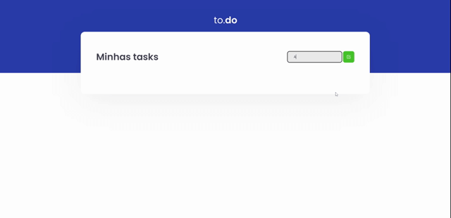

### Desafio 01 - Conceitos do React

#💻Sobre o desafio

 Nesse desafio, você deverá criar uma aplicação para treinar o que aprendeu até agora no ReactJS
Essa será uma aplicação onde o seu principal objetivo é uma pequena aplicação de atividades a fazer, para treinar um pouco mais sobre manipulação do estado no React.

- Adicionar uma nova tarefa
- Remover uma tarefa
- Marcar e desmarcar uma tarefa como concluída

- Gif

